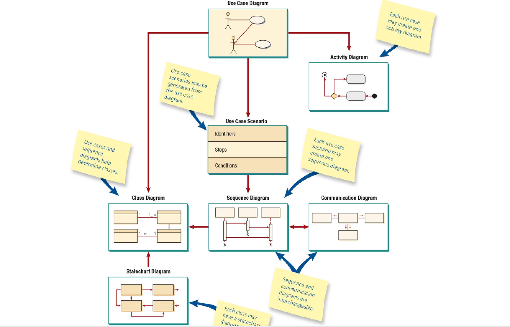
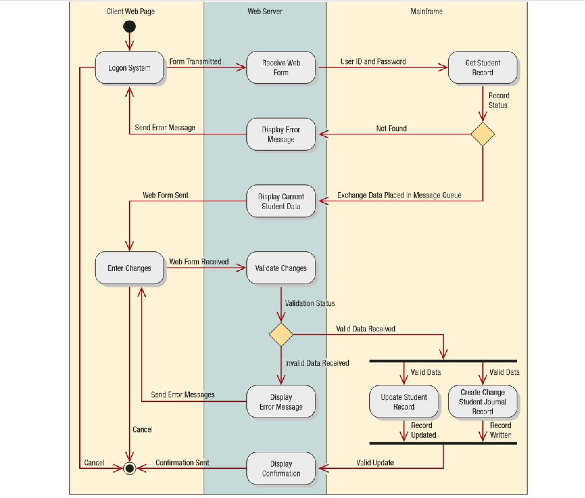
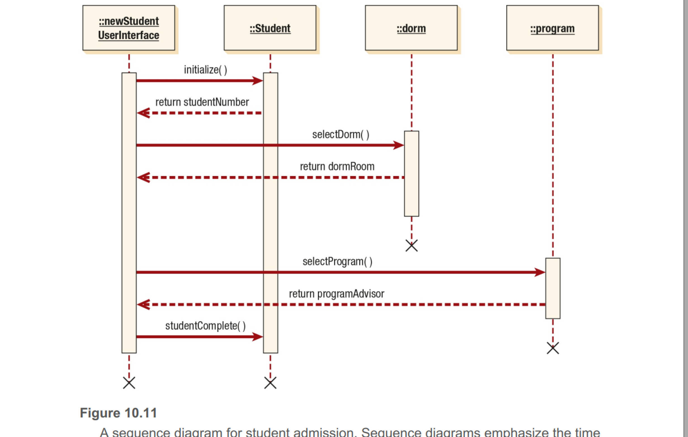
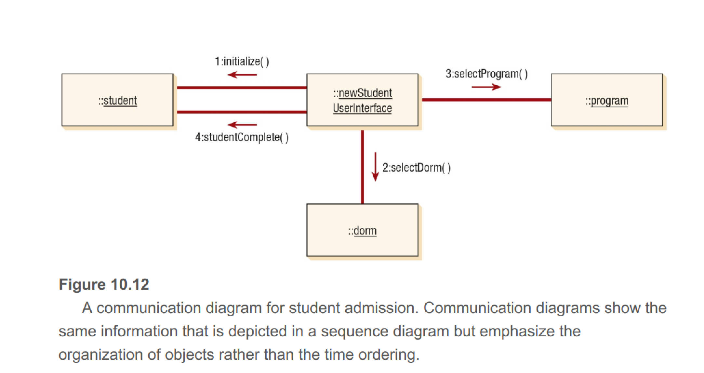
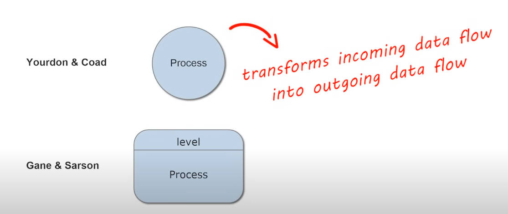
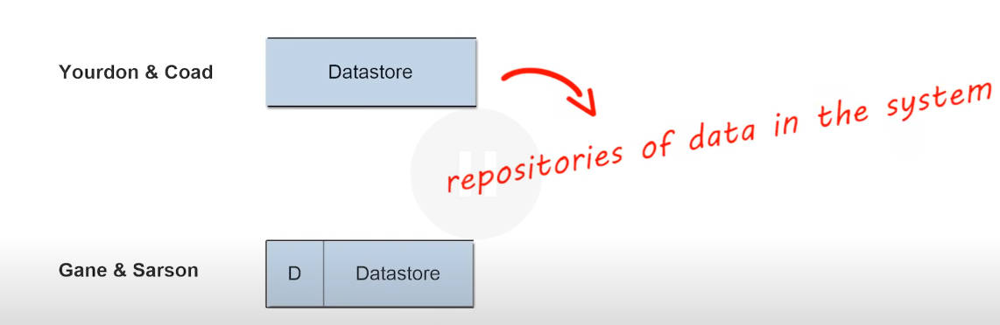
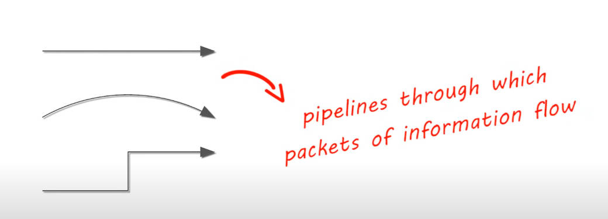
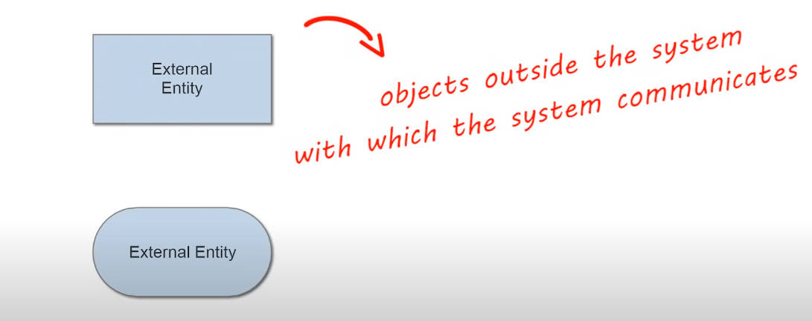

# chp10 OOSAD
**CRC Card and Think**

CRC Card stands for class, responsibilities, and collaborators. They are used to represent or model a system from an object-oriented perspected and the responsibilities of classes and the interaction between the classes.

## UML and its components
**things**
* *structural things*: classes, interfaces, collaborations, use cases, active classes, components, nodes;
* *behavioral things*: interactions, state machines
* *Grouping things*: packages
* *Anotational things*: Notes

**Relationships**
* *structural relationships*: dependencies, aggregations, associations, generalizations
* *behavioral relationships*: communicates, includes, extends, generalizes

**Diagrams**
* *structural diagrams*: class diagrams, component diagrams, deployment diagrams
* *behavioral diagrams*: use case diagram, sequence diagram, communication diagram, statecart diagram, activity diagram

**UML Most Common Diagrams**: showing how each diagram leads to the development of other UML diagrams

* activity diagram with swimlanes

* sequence diagram

	- *annotations*

		+ **objectName:**: a name with a colon after it represents an object
		+ **:class**: a colon with a name after it represents a class
		+ **objectName:class**: a name, followed by a colon and another name, represents an object in a class
		+ **vertical line**: represents the lifeline for the class or object, when it is created and destroyed ('X')
		+ **lateral bar/vertical rectangle**: shows the focus of the control (process)
		+ **horizontal arrows**: show messages or signals that are sent between the classes.
			* solid arrowhead means sync calls
			* half/open arrowhead means async calls or those without return (void)
		
* communication diagram: represents the organization with same information from sequence diagram

* class diagram

# chp6 Agile
1, Agile can definitely improve efficiencies in several domains compared to waterfall SDLC. Some of its variants also called iterative/adaptive development, which can include adhoc or urgent needs in the sprint/iteration without pending on the long-term waterfall phase 1 completion before starting on phase 2 features. Waterfall model sees the whole system as one single unit. Each step in the waterfall model rely on prerequisite steps to be completed or accepted. If any changes needed amid the process, you will need downtime to finish previous tasks and then start from the 1st step again. This is not flexible, time-consuming and low efficient. Agile comes into solving the pain points from the traditional waterfall model. It decompose the whole tasks into small user stories/delievrables/functionalities/microservices/phases which could be deployed on the go or developed independently. Theretically, that means you can start any new tasks without dependency on previous tasks if they are not co-related. Agile method also does not require any specific time frame or downtime to deploy the changes. To wrap up, agile is aiming to shrink the downtime, planning time and make your new ideas implemented as soon as possible to gain more advantage in latest market.

# Chap7 Data flow Diagram (DFD)
It's developed around 1970 to help software development. It could clearly define the system input and system output as well as where its flows and where it would be stored. This can definitely help the system analyst or system architect to design how the system looks like or how the data would flow in the system. Two types of DFD notation:
1. Yourdon & Coad
	* more convenient in system analysis and design tasks
	* processes are noted by Circle
2. Gane & Sarson
	* more common for visualizing information systems
	* processes are noted by Square with round corner
3. Terms
A process means the procedure step to transform input data into output format.
	* 
A datastore is a storage unit of data in the system, usually are files or databases
	* 
A data flow is a pipeline with data flow into it from source to destination. Usually it's associated with arrow(direction)
	* 
A external entity is an interactive object that's outside of the organization/system. They are usually the root sources and final terminals of the data inputs and outputs. Sometimes we called upstream, downstream systems.
	* 
A level/layer in the DFD is an abstract concept to categorize some aggregated data flows which are correlated with each other.
Context diagram is usually called root level or top level or level 0 data flow diagram. It only contains one process node that is an overview of the whole system in relationship to external entities. From then on, can go to detailed data flows for each function level by level, detail more detailed until the pseudocode.

# Chp5 Unobstrusive methods for info gathering
This chapter covers unobstructive methods for info gathering, including sampling, investigation of quantitative and qualitative data in current and archived forms, process and task mining, workspace analytics, and observation of the decision maker's activities through the use of the analyst's playscript and physical env thru STROBE
* sampling, the process of systematically selecting representative elements of a population is called sampling. the purpose is to select and study supporting material about the survey objects. Sampling can reduce cost, speed, data gathering, potentially make the study more effective, and reduce bias. 
	- Four steps to design sample
		- determine population 
		- determine type of sample
		- calc size of sample
		- plan the data to be collected and described
	- types of sampling
		- convenience samples
		- purposive samples
		- simple random samples
		- complex random samples
	- the historic and current data of the org could bring more insights to system analysts on the transition of the org and give a good base to predict the future. There are different analytic tools to collect both structured, semi-structured or non-structured data from different channels to help making better decisions. Documents is worthless in analyzing an org, no matter it's quantitative or qualitative.
	- using automation API scan process tools is another way to identify problem occurance in process mining. Task mining uses desktop captures to help enhance the processes.
	- Workforce analytics can help to understand workloads and performance
	- observation is a close face-to-face interactive way to study the objects, you will gain first-hand, real-time infomation. Playscript is a tool that's used often in the observation approach.
	- STROBE method is to mimic the decision makers' environment like a film analytics.

# Chp4 Interactive methods for info gathering
This chapter mainly focuses on the interactive methods we could use when gathering information for system analysis and design. They are:
* interviewing
	- listen for human-computer interaction concerns on all kinds of topics with decision makers
	- interview is a planned question-and-anwser dialogues between two people either via online or offline meetings. There are five steps to take the interview
		+ read background material
		+ establish interviewing objectives
		+ decide who to interview
		+ prepare the interviewee
		+ decide on the question types and structure
			* question types: open-ended and closed
			* three structural types: pyramid, funnel and diamond
				- pyramid begins with detailed, closed questions, and broaden to more generalized questions
				- funnel begin with open-ended questions, and the funnel down to more specific, closed questions
				- diamond shaped combine the strengths of the other two structures, but they take longer to conduct 
* joint application design (JAD)
	- Using JAD, analysts can both analyze human info requirements and design a user interface with users in a group setting
* construction of questionnaires (surveys)
	- can gather data on HCI concerns, attitudes, beliefs, and charcters from key people in the org
	- useful when people of the org are dispersed, exploratory work is needed, or problem sensing is needed before interviewing
	- Scaling is the process of assigning numbers or other symbols to an attitude or character
	- consistent control of the questionanaire format and style can result in a better response rate
	- meaningful ordering and clustering can help make the questionnaires easier to understand
	- Surveys can be admined via different ways, web, email or physical meetings
	- storytelling is another way to gather info
* six methods of requirements or features prioritization
	- simple ranking
	- the 100-token method
	- the MoSCow method
	- Urgent/Important Matrix
	- analytic heirarchy processing
	- Q-sort

# Chp3 

# chp2 Understanding and Modeling organizational Systems
## How to understand the system
* three main inputs to understand the info system
	* levels of management
	* design of organizations
	* organizational cultures
* three different ways to seeing the organization include:
	* drawing context-level data flow & entity-relationship (E-R) models
	* developing user cases
	* writing user case scenarios

Collaborative design can help system analyst include users from many parts of the organization. Good communication channel perfects and speeds up the design phase, like social media chat apps: Teams, Slack, etc

### Organization as Systems
Organizations and their members are usefully conceptualized as systems. Organizations are composed of smaller, interrelated systems (departments, units, divisions, etc) that work out specific functions. It's very important to understand the organization as a holistic view.

All systems including their subsystems are corelated, but also has their own customized functions. Organizational boundaries would be mapped to the division of subsystems, and the communication (inputs/outputs) between the departments across the boundaries could be seen as the interfaces. In information system, subsystems/modules talk to each other via interfaces. As a kind of system control, feedback/outputs is commonly used to build plan and process control flow. 
* An environment means the outside/external circumstances, including demographic, economic, political, legal settings. Virtual working environment provides more chances for work-life balance job seekers. Unknown cons and pros are still under research. Generally speaking, we preferred viewing the system in a holistic view, no matter what role you are in. To draft overview of the whole organization, it's better to look into the inter-relationships between systems and avoid bias from invidiual positional feeling/views. 
* Enterprise resource planning (ERP, like SAP or Oracle Cloud) is a popular tool to design and implement system flow especially in integration with legacy system. ERP plays an role as real game changers. 
* Entity-relationship (E-R) model Approaches: it's a great tool to show the system scope and system boundaries definition. In the methodology, everything from the organization is seen as an entity. A relationship is to describe the internal linkage among entities. Many popular conventions like crow's foot, arrow, and Bachman notation) are for drawing ER diagrams. This could help to futher make the organization more visualize, understandable, and digitable.
* Use Case Modeling
	- originally a diagram from unified modeling language (UML), now it's more a type of system architecture overview from the actor(system users) interactive perspective. It's also more of role-based functions view of the system. A use case is usually used to describe a single transaction or event.
	- relationships: 
		- communicates
		- includes: shows the common use case is included in more than one use cases. A dotted arrow that points to the common use case indicates the includes relationship
		- extends: allows the new use case to handle a variation or an exception from the basic use case. The arrow goes from the extended to the basic use case.
		- generalizes
	- A use case scenario is divided into three sections: identification and initialization; steps performed; and conditions, assumptions, and questions.
	- Reasons for writing use cases
		- effectively communicate systems requirements because the diagrams are kept simple
		- allow people to tell stories
		- make sense to non-tech people
		- do not depend on a special language
		- can describe most functional requirements (such as interactions between actors and apps)
		- can describe non-functional requirements (such as performance and maintainability) thru the use of stereotypes
		- help analysts define boundaries
		- can be traceable

## levels of managemnt have different implications to system development
Three broad, horizontal levels: from bottom to up
1. operational control
	* OMs use predefined rules that have predictable outcomes to make decisions, their scope could include: work scheduling, inventory control, shipping, receiving, and control of processes, focusing on detail implementations
	* OMs need internal info that is of a repetitive, low-level nature; focusing on instant solution just for current situations, little need on historic info and external info
	*
2. managerial planning and control (middle management)
	* sr managers make short-term plan and control decisions about how resources may best be allocated to meet the org objectives
	* need both short-term and longer-term info, high need 
3. strategic management
	* the highest level, look outward from the org to the future, make desisions to guide the OMs and Middle level in the months and years ahead. This level managers often have multiple decision objectives, and hard to identify detailed problems and most of the time facing semistructured problems. Whereas, operation managers have single objective,  easy to identify pain points/problems and dealt with structured problems.
	* highly rely on external info on the market trends and strategies of competing corporations

## Organizational Culture
It's meaningful to consider org culture in designing systems.
	* little standards sets on an organizational subculture, rather than see the culture as a whole, more useful to think about the shared verbal and nonverbal symbolism.
		- verbal symbolism includes shared language used to construct, convey and preserve subcultural myths, metaphors, visions, and humor
		- nonverbal symbolism includes shared artifacts, rites, and ceremonies; clothings, decoration of offices, rituals for celebrating birthdays, promotions and retirements
	* understanding and recognizing predominant org subcultures could help 

# Chp1 System, Roles and Development Methodologies

1. How can you, as a systems analyst, gain the trust of your clients?
2. How can you communicate your enthusiasm about working with your clients in ways other than in words?
3. What are some of the mistakes that the pet consultant in the video made in working with her client?
4. The systems analyst must be ethical. For example, you shouldn’t promise features of software that you may not deliver. What are otherethical standards that forming a relationship with a client might entail?

System Analyst is the person who analyzes and builds the whole system. By digesting the needs of clients, they would take use of below skills to implement those business requirements for clients, like business domain knowledge, system achitecture, data input analysis, data pipeline in particular industry. 
* Security Concern, the very important factor in business informations system. It suggest system analyst should consider system security from the first step till the end of development life cycle. What's more, you should also continuously gather feedbacks from security toolkits or users to improve your security components and strategy. However, it turns out that an ideal security system is not practical, most companies business systems make trade-offs between customer data storage and the risk of data breach.
* Planning
* User Involvement/Communication

## Primary Roles of a system analyst
* Consultant
	- outsider consultant might bring new perspection which does not come out from internal team
	- outsider lack of own understanding of specific info system infrastructure
	- outsider had little idea of company culture or subculture when co-work with system users
* Supporting expert
	- did the detailed implementation assignments led by info system management team
	- do less decision making
* Agent of change
	- the most responsible role, acts as a hub to make the communication more efficient by bridging the gaps between departments or stakeholders

## Systematic Approaches for system analysis and design 
1. System Development life cycle(SDLC)
	* System Development life cycle Phases
		1. Identify problems and opportunities, and objectives;
			* Very first and critical step
		2. Determine human information requirements;
			* understand how user work with their information system
		3. Analyze system needs
			* Utilize tools like form flow, activity diagrams, sequence diagrams etc to illustrate system
			* Utilize decision tools like decision tree, dicision tables, structured English
		4. Design the recommended system;
			* GUIs(UI/UX)
			* data storage and presentation
		5. develop and document software
			* shows users how to use software and how to fix software problem
		6. test and maintain system
			* test should be done to verify all the client needs are meet
		7. implement and evaluate system
			* sometimes create/design a brand new system might save cost comparing to continuous system maintenance
	* Using CASE Tools (Computer-aided software engineering)
		* large collection of records, elements, diagrams, screens, reports and other info
2. The Agile approach
	* is an adaptive lifecycle
	* is an extension of the object-oriented approach to systems development
	* based on values, principles, and core practices. The four values are communication, simplicity, feedback, and courage.
	* Scrum is an type of agile method that popular in the industry bi-weekly to four-weekly sprint cycle.
	* interactive and incremental

## Object-Oriented Systems Analysis and Design

## Cloud Development Life Cycle

